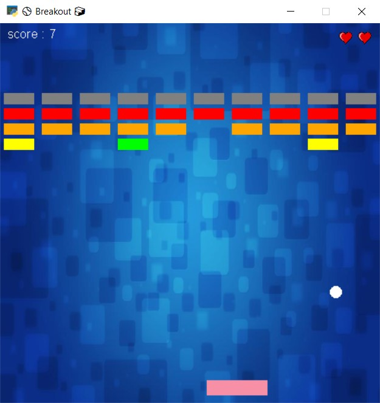

# ⚾ Breakout 🧱

This game is designed using [arcade](https://api.arcade.academy/en/latest/) library in python.

At the beginning, your score is zero and you have three lives. You get one point by breaking each brick. Every time the ball goes down from the game board, you will lose one point and one life. If you run out of lives or your points are less than zero, you'll lose.

---
## Usage 🎮

First install requirement package:
```
pip install arcade
```
Then you can run this program:
```
python main.py
```
**NOTE :** You can move your racket left and right by shaking the mouse or press left and right buttons.

---
## Game Environment:

