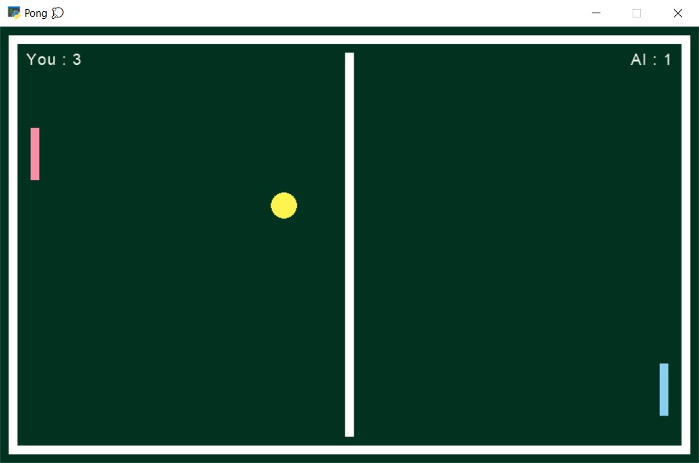

# ⚾ Pong 🏓

This game is designed using [arcade](https://api.arcade.academy/en/latest/) library in python. Your opponent in this game is a simple artificial intelligence.

At the beginning, your score and AI's score are zero. If the rival cannot catch your ball, your score will be increased by one, and if you cannot catch the competitor's ball, the AI score will be increased by one.

---
## Usage 🎮

First install requirement package:
```
pip install arcade
```
Then you can run this program:
```
python main.py
```
**NOTE :** Your opponent's racket and yours only moves up and down. You can move your racket up and down by shaking the mouse.

---
## Game Environment:

