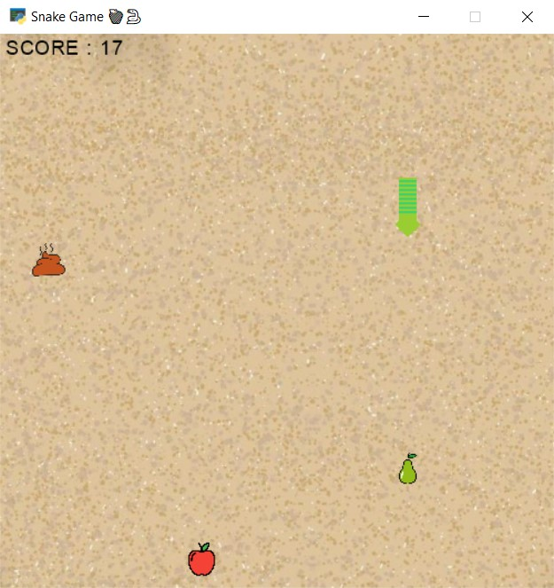
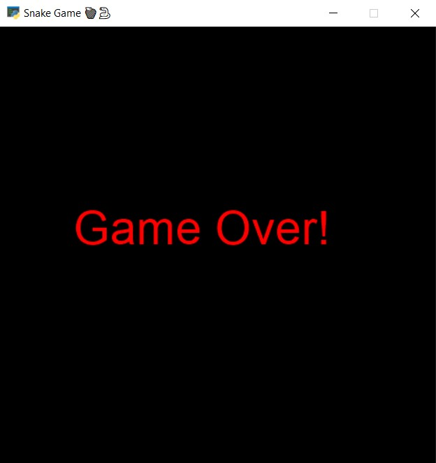

# 🍎 Snake Game 🐍

This game is made using [arcade](https://api.arcade.academy/en/latest/) library. At the beginning of the game, your score is zero. Your score increases by 1 point for each apple and 2 points for each pear. You also lose 1 point by eating each poop. If your score becomes zero or less or the snake hits its body or leaves the game screen, you will be game over.

Using the file [main_ai.py](https://github.com/mahtabmahdavi/Arcade-Games/blob/main/Snake/main_ai.py) you can play this game with artificial intelligence.

---
## Usage 🎮

First install requirement package:
```
pip install arcade
```
Then you can run this program:
```
python main.py
python main_ai.py
```
**Press these keys to:**
- Up key to move the snake to the up.
- Right key to move the snake to the right.
- Down key to move the snake to the down.
- Left key to move the snake to the left.

---
## Game Environment:



